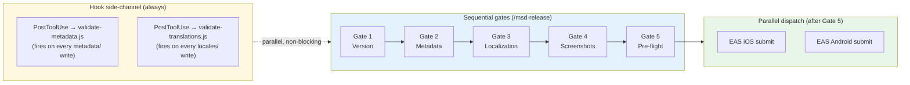
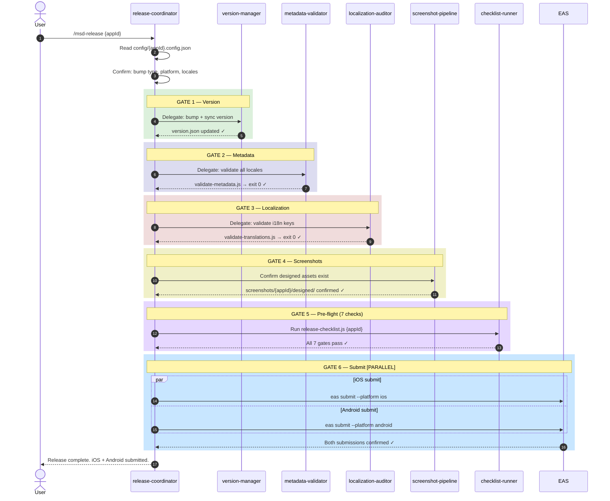

# mobile-store-deploy

> An open-source Claude Code plugin that automates the full mobile app release pipeline for iOS and Android.

[](LICENSE)
[](CONTRIBUTING.md)

## Installation (Claude Code)

```bash
/plugin marketplace add mobile-store-deploy
/plugin install mobile-store-deploy
```

## Installation (agentskills.io — Claude Code, Cursor, Codex)

```bash
npx skills add mobile-store-deploy
```

## Quick Start

### Step 1 — Register your app

```bash
# Copy the config template for your app (replace "myapp" with your app ID)
cp config/.template.config.json config/myapp.config.json
```

Edit `config/myapp.config.json`:
```json
{
  "appId": "myapp",
  "displayName": "My App",
  "platforms": ["ios", "android"],
  "locales": ["en"],
  "eas": {
    "projectId": "",
    "profile": "production"
  },
  "geo": { "entityAnchor": "" }
}
```

### Step 2 — Initialize version tracking

```bash
mkdir -p versions/myapp
cat > versions/myapp/version.json << 'EOF'
{
  "semver": "1.0.0",
  "ios": { "CFBundleShortVersionString": "1.0.0", "CFBundleVersion": "1" },
  "android": { "versionName": "1.0.0", "versionCode": 1 }
}
EOF
```

### Step 3 — Write store metadata

```bash
mkdir -p metadata/myapp/ios/en-US metadata/myapp/android/en-US

# iOS (Apple App Store)
echo "My App"              > metadata/myapp/ios/en-US/name.txt           # max 30 chars
echo "Short tagline here"  > metadata/myapp/ios/en-US/subtitle.txt       # max 30 chars
echo "habit,daily,tracker" > metadata/myapp/ios/en-US/keywords.txt       # max 100 chars, no spaces after commas
echo "Full description..." > metadata/myapp/ios/en-US/description.txt    # max 4000 chars
echo "Promo text here"     > metadata/myapp/ios/en-US/promotional.txt    # max 170 chars
echo "Bug fixes"           > metadata/myapp/ios/en-US/release_notes.txt  # max 4000 chars

# Android (Google Play)
echo "My App"              > metadata/myapp/android/en-US/title.txt              # max 30 chars
echo "Short description"   > metadata/myapp/android/en-US/short_description.txt  # max 80 chars
echo "Full description..."  > metadata/myapp/android/en-US/full_description.txt  # max 4000 chars, IS indexed
echo "Bug fixes"           > metadata/myapp/android/en-US/release_notes.txt      # max 500 chars (NOT 4000)
```

### Step 4 — Validate metadata

```bash
node skills/managing-store-metadata/scripts/validate-metadata.js myapp
# Fix any character limit violations before continuing
```

### Step 5 — Set up translations (if multi-locale)

```bash
mkdir -p locales/myapp
# Create en.json as the source of truth
echo '{ "welcome": "Welcome", "start": "Start" }' > locales/myapp/en.json
# Create one file per locale
echo '{ "welcome": "Hoş geldiniz", "start": "Başla" }' > locales/myapp/tr.json

node skills/managing-app-localizations/scripts/validate-translations.js myapp
```

### Step 6 — Run pre-flight checklist

```bash
node skills/submitting-app-release/scripts/release-checklist.js myapp
# All 7 gates must pass. Fix any failures before submitting.
```

### Step 7 — Sync version to your app

```bash
# Bumps patch version (1.0.0 → 1.0.1) and syncs to app.json, Info.plist, build.gradle
node skills/managing-app-versions/scripts/bump-version.js myapp patch
node skills/managing-app-versions/scripts/sync-build-numbers.js myapp \
  --project-root /path/to/your/expo/app
```

### Step 8 — Build and submit (Expo EAS)

```bash
cd /path/to/your/expo/app
eas build --platform all --profile production
eas submit --platform all --profile production
```

### For subsequent releases

```bash
# 1. Bump version
node skills/managing-app-versions/scripts/bump-version.js myapp patch

# 2. Update release notes per locale
echo "New feature: ..." > metadata/myapp/ios/en-US/release_notes.txt
echo "New feature: ..." > metadata/myapp/android/en-US/release_notes.txt

# 3. Validate everything
node skills/submitting-app-release/scripts/release-checklist.js myapp

# 4. Sync version to app
node skills/managing-app-versions/scripts/sync-build-numbers.js myapp \
  --project-root /path/to/your/expo/app

# 5. Build and submit
cd /path/to/your/expo/app && eas build --platform all --profile production && eas submit --platform all --profile production
```

> **See `docs/README.md`** for the full platform setup guides, Apple Store checklist, Play Store checklist, and multi-app management.

## Slash commands

| Command | What it does |
|---|---|
| `/msd-release` | Full release pipeline — version bump → validate → submit |
| `/msd-bump` | Bump version number only |
| `/msd-screenshots` | Generate and validate store screenshots |
| `/msd-metadata` | Update and validate store metadata |
| `/msd-locale` | Add language or fix missing translation keys |
| `/msd-validate` | Run all validation checks without submitting |
| `/msd-select-locales` | Select or update app's supported locales |
| `/msd-aso` | ASO keyword research and metadata optimization |
| `/msd-geo` | GEO content — schema markup, entity anchor, ProductHunt |
| `/msd-init` | Register a new app — creates config, versions, and metadata directories |
| `/msd-build` | Build with EAS — development, preview, or production profile |
| `/msd-status` | Show version, locale coverage, and pending actions for a registered app |
| `/msd-checklist` | Interactive first-release checklist for App Store or Play Store |
| `/msd-permissions` | Validate iOS NSUsageDescription strings and Android dangerous permissions |
| `/msd-release-notes` | Draft "What's New" release notes for all configured locales |
| `/msd-discover` | Scan a directory to find all Expo/React Native apps and registration status |

## What it solves

| Problem | Solution |
|---|---|
| Version numbers diverge across iOS, Android, app.json | `versions/{app-id}/version.json` — single source of truth |
| 300+ screenshots per release | 2-phase pipeline: simulator capture → app-store-screenshots design |
| Metadata silently rejected for char limit violations | `validate-metadata.js` enforces hard limits pre-upload |
| i18n keys missing from some locales | `validate-translations.js` blocks CI until all keys present |
| No pre-submission validation pipeline | `release-checklist.js` runs 7 sequential gates |

## Key constraints enforced

- Apple App Name / Subtitle: **30 chars** each (hard limit)
- Apple Keywords: **100 chars** (comma-separated, no spaces)
- Apple Description: **4,000 chars** (NOT indexed for search)
- Google Short Description: **80 chars** (IS indexed)
- Google Full Description: **4,000 chars** (IS indexed — include keywords)
- Google What's New: **500 chars** (not 4,000 like iOS)
- Android versionCode: monotonically increasing, never decrement

## How commands and workflows execute (concurrency overview)

The plugin has two execution modes — **sequential gates** and **parallel dispatch** — and a **hook side-channel** that runs independently of both.



- **Sequential gates** enforce correctness: each gate must exit 0 before the next starts.
- **Parallel dispatch** applies to EAS builds/submits (iOS + Android fire simultaneously) and multi-locale validation reads.
- **Hook side-channel** auto-validates metadata and translation files on every write, independent of the active command.

### Full pipeline — agents, gates, and parallel submit



See **[docs/CONCURRENCY.md](docs/CONCURRENCY.md)** for full diagrams, agent dispatch rules, and a decision reference for AI models.

## Automatic hooks

The plugin validates metadata character limits when you edit any file under `metadata/`
and checks translation completeness when you edit files under `locales/`.

## External OSS tools

- [ParthJadhav/app-store-screenshots](https://github.com/ParthJadhav/app-store-screenshots) — MIT — screenshot design
- [i18next](https://github.com/i18next/i18next) — MIT — runtime i18n
- [expo/eas-cli](https://github.com/expo/eas-cli) — MIT — Expo builds
- [LenserFight](https://github.com/conectlens/lenserfight) — brand kit + icon generation

## Roadmap

Flutter, Swift (non-Expo), Kotlin Multiplatform, Capacitor, bare React Native, and CI/CD integrations (GitHub Actions, Bitrise, Fastlane) are all tracked in **[docs/ROADMAP.md](docs/ROADMAP.md)**. Platform PRs are especially welcome.

## Contributing

See **[CONTRIBUTING.md](CONTRIBUTING.md)** for setup instructions, code style guidelines, and the PR checklist. All participants are expected to follow our Code of Conduct.

## Security

Do **not** open a public issue for security vulnerabilities. See **[SECURITY.md](SECURITY.md)** for the responsible-disclosure process.

## License

MIT — see [LICENSE](LICENSE)
