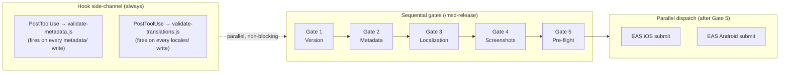
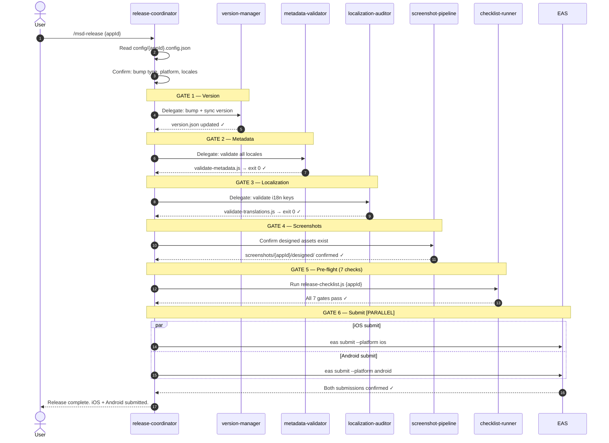

# automobileapp

> An open-source Claude Code plugin that automates the full mobile app release pipeline for iOS and Android.

[](LICENSE)
[](CONTRIBUTING.md)

## Installation (agentskills.io — Claude Code, Cursor, Codex)

```bash
npx skills add ofcskn/mobile-automation-plugin
```

> **Note:** If you cloned the repo under a different name, use `npx skills add ofcskn/<your-repo-name>` instead.

## Installation (Claude Code plugin)

```bash
# Step 1 — add the marketplace (one-time)
/plugin marketplace add ofcskn/mobile-automation-plugin

# Step 2 — install the plugin
/plugin install automobileapp@automobileapp
```

After installation, run `/reload-plugins` to activate it.

## Quick Start

### First release

```
/automobileapp:msd-init com.myapp.app
```

Registers your app — creates the config, version file, and metadata directories. Claude will prompt for your app name, platforms, locales, and EAS project ID.

```
/automobileapp:msd-release com.myapp.app
```

Runs the full pipeline: version bump → metadata validation → localization check → screenshots → pre-flight gates → EAS build and submit for iOS and Android.

### Subsequent releases

```
/automobileapp:msd-release com.myapp.app
```

Same command every time. Claude determines what changed and runs only the necessary stages.

> **See `docs/README.md`** for platform setup guides, multi-app management, and CI/CD integration.

## Slash commands

| Command | What it does | Sources |
|---|---|---|
| `/automobileapp:msd-release` | Full release pipeline — version bump → validate → submit | [managing-app-versions](skills/managing-app-versions/) · [managing-store-metadata](skills/managing-store-metadata/) · [managing-app-localizations](skills/managing-app-localizations/) · [generating-store-screenshots](skills/generating-store-screenshots/) · [submitting-app-release](skills/submitting-app-release/) · [release-coordinator](agents/release-coordinator.md) |
| `/automobileapp:msd-init` | Register a new app — creates config, versions, and metadata directories | [managing-app-registry](skills/managing-app-registry/) · [app-registry-manager](agents/app-registry-manager.md) |
| `/automobileapp:msd-bump` | Bump version number only | [managing-app-versions](skills/managing-app-versions/) · [version-manager](agents/version-manager.md) |
| `/automobileapp:msd-screenshots` | Generate and validate store screenshots | [generating-store-screenshots](skills/generating-store-screenshots/) · [screenshot-pipeline](agents/screenshot-pipeline.md) |
| `/automobileapp:msd-metadata` | Update and validate store metadata | [managing-store-metadata](skills/managing-store-metadata/) · [metadata-validator](agents/metadata-validator.md) |
| `/automobileapp:msd-locale` | Add language or fix missing translation keys | [managing-app-localizations](skills/managing-app-localizations/) · [selecting-app-locales](skills/selecting-app-locales/) · [localization-auditor](agents/localization-auditor.md) |
| `/automobileapp:msd-validate` | Run all validation checks without submitting | [managing-store-metadata](skills/managing-store-metadata/) · [managing-app-localizations](skills/managing-app-localizations/) · [submitting-app-release](skills/submitting-app-release/) |
| `/automobileapp:msd-select-locales` | Select or update app's supported locales | [selecting-app-locales](skills/selecting-app-locales/) · [locale-selector](agents/locale-selector.md) |
| `/automobileapp:msd-aso` | ASO keyword research and metadata optimization | [optimizing-aso-seo](skills/optimizing-aso-seo/) · [aso-geo-optimizer](agents/aso-geo-optimizer.md) |
| `/automobileapp:msd-geo` | GEO content — schema markup, entity anchor, ProductHunt | [optimizing-geo](skills/optimizing-geo/) · [aso-geo-optimizer](agents/aso-geo-optimizer.md) |
| `/automobileapp:msd-build` | Build with EAS — development, preview, or production profile | [submitting-app-release](skills/submitting-app-release/) · [release-coordinator](agents/release-coordinator.md) |
| `/automobileapp:msd-status` | Show version, locale coverage, and pending actions for a registered app | [managing-app-registry](skills/managing-app-registry/) · [app-registry-manager](agents/app-registry-manager.md) |
| `/automobileapp:msd-checklist` | Interactive first-release checklist for App Store or Play Store | [submitting-app-release](skills/submitting-app-release/) · [checklist-runner](agents/checklist-runner.md) |
| `/automobileapp:msd-permissions` | Validate iOS NSUsageDescription strings and Android dangerous permissions | [managing-app-permissions](skills/managing-app-permissions/) |
| `/automobileapp:msd-release-notes` | Draft "What's New" release notes for all configured locales | [managing-store-metadata](skills/managing-store-metadata/) · [managing-app-localizations](skills/managing-app-localizations/) · [localization-auditor](agents/localization-auditor.md) |
| `/automobileapp:msd-discover` | Scan a directory to find all Expo/React Native apps and registration status | [managing-app-registry](skills/managing-app-registry/) · [app-registry-manager](agents/app-registry-manager.md) |

## What it solves

| Problem | Solution |
|---|---|
| Version numbers diverge across iOS, Android, app.json | `versions/{app-id}/version.json` — single source of truth |
| 300+ screenshots per release | 2-phase pipeline: simulator capture → app-store-screenshots design |
| Metadata silently rejected for char limit violations | `validate-metadata.js` enforces hard limits pre-upload |
| i18n keys missing from some locales | `validate-translations.js` blocks CI until all keys present |
| No pre-submission validation pipeline | `release-checklist.js` runs 7 sequential gates |

## Key constraints enforced

- Apple App Name / Subtitle: **30 chars** each (hard limit)
- Apple Keywords: **100 chars** (comma-separated, no spaces)
- Apple Description: **4,000 chars** (NOT indexed for search)
- Google Short Description: **80 chars** (IS indexed)
- Google Full Description: **4,000 chars** (IS indexed — include keywords)
- Google What's New: **500 chars** (not 4,000 like iOS)
- Android versionCode: monotonically increasing, never decrement

## How commands and workflows execute (concurrency overview)

The plugin has two execution modes — **sequential gates** and **parallel dispatch** — and a **hook side-channel** that runs independently of both.



- **Sequential gates** enforce correctness: each gate must exit 0 before the next starts.
- **Parallel dispatch** applies to EAS builds/submits (iOS + Android fire simultaneously) and multi-locale validation reads.
- **Hook side-channel** auto-validates metadata and translation files on every write, independent of the active command.

### Full pipeline — agents, gates, and parallel submit



See **[docs/CONCURRENCY.md](docs/CONCURRENCY.md)** for full diagrams, agent dispatch rules, and a decision reference for AI models.

## Automatic hooks

The plugin validates metadata character limits when you edit any file under `metadata/`
and checks translation completeness when you edit files under `locales/`.

## External OSS tools

- [ParthJadhav/app-store-screenshots](https://github.com/ParthJadhav/app-store-screenshots) — MIT — screenshot design
- [i18next](https://github.com/i18next/i18next) — MIT — runtime i18n
- [expo/eas-cli](https://github.com/expo/eas-cli) — MIT — Expo builds
- [LenserFight](https://github.com/conectlens/lenserfight) — brand kit + icon generation

## Roadmap

Flutter, Swift (non-Expo), Kotlin Multiplatform, Capacitor, bare React Native, and CI/CD integrations (GitHub Actions, Bitrise, Fastlane) are all tracked in **[docs/ROADMAP.md](docs/ROADMAP.md)**. Platform PRs are especially welcome.

## Contributing

See **[CONTRIBUTING.md](CONTRIBUTING.md)** for setup instructions, code style guidelines, and the PR checklist. All participants are expected to follow our Code of Conduct.

## Security

Do **not** open a public issue for security vulnerabilities. See **[SECURITY.md](SECURITY.md)** for the responsible-disclosure process.

## License

MIT — see [LICENSE](LICENSE)
