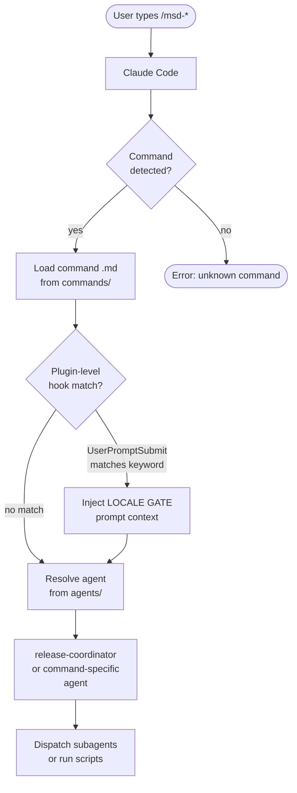
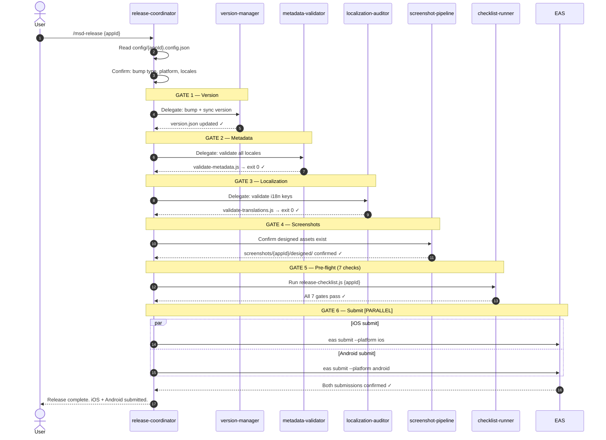
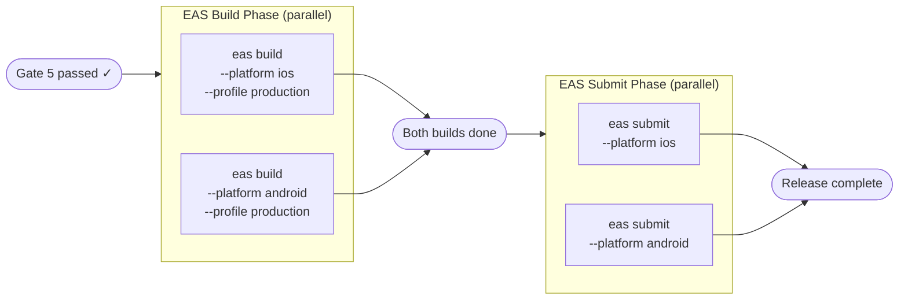
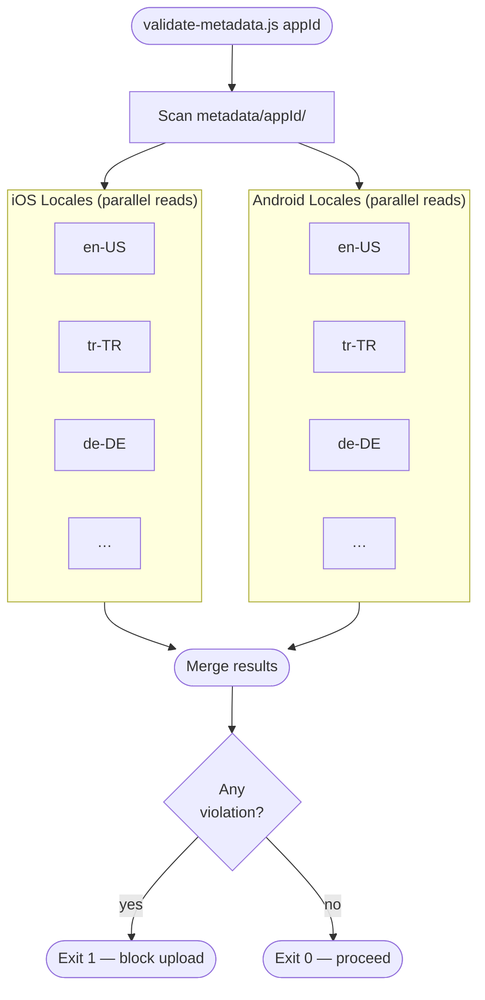
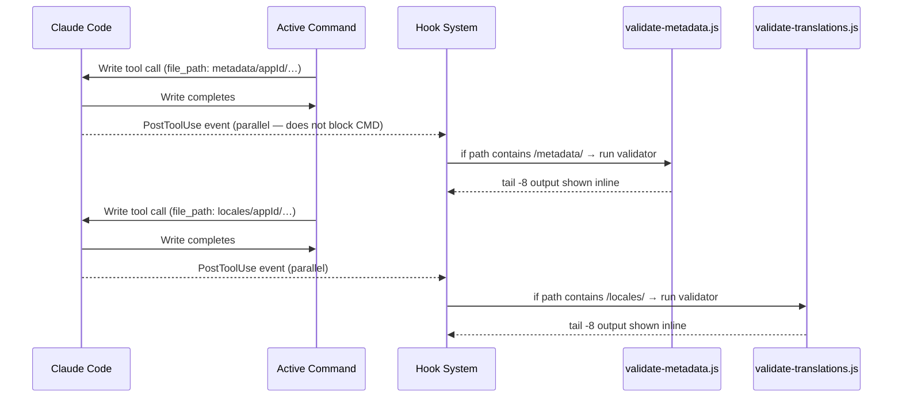
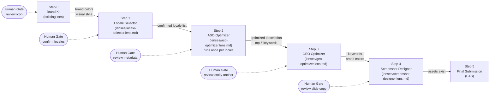
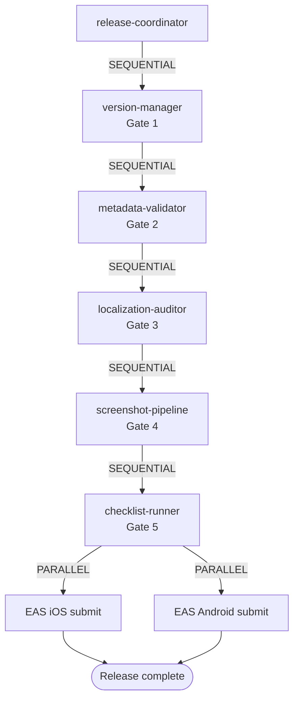

# Concurrency & Parallelism in mobile-automation-plugin

> **For developers and AI models.** This document explains precisely which pipeline
> stages run sequentially (gated by the previous result) and which run in parallel
> (dispatched simultaneously, merged at a sync point). Both diagrams and prose are
> provided so AI agents can reason about execution order without parsing code.

---

## Table of Contents

1. [Mental Model](#mental-model)
2. [Command Dispatch Flow](#command-dispatch-flow)
3. [Release Pipeline — Sequential Gates](#release-pipeline--sequential-gates)
4. [Multi-Platform Parallelism](#multi-platform-parallelism)
5. [Multi-Locale Parallelism](#multi-locale-parallelism)
6. [Hook Side-Channel (Always Parallel)](#hook-side-channel-always-parallel)
7. [launch-ready Workflow — Lens Chain](#launch-ready-workflow--lens-chain)
8. [Agent Dispatch Rules](#agent-dispatch-rules)
9. [Decision Reference for AI Models](#decision-reference-for-ai-models)

---

## Mental Model

The plugin has **three concurrency planes**:

| Plane | What runs in parallel | Sync point |
|---|---|---|
| **Agent plane** | Multiple specialized subagents dispatched simultaneously | Coordinator waits for all before next gate |
| **Platform plane** | iOS and Android EAS builds / submissions | Both must succeed before release is marked complete |
| **Hook plane** | `PostToolUse` validators fire on every file write | Fires asynchronously — does not block the main command |

Sequential gates always apply **between** pipeline phases. Parallelism always applies
**within** a phase.

---

## Command Dispatch Flow

**Key point for AI models:** The `UserPromptSubmit` hook fires *before* the command
runs and injects additional context into the prompt. This is not visible in the command
`.md` file — it is a side-channel injection from `hooks/hooks.json`.

---

## Release Pipeline — Sequential Gates

`/msd-release` (and `release-coordinator` agent) enforces this exact order.
**No step may start until the previous step exits without error.**

> **Gate behavior:** If any gate returns a non-zero exit code, the release-coordinator
> stops immediately, reports the exact failure, and waits for user action. It never
> auto-proceeds past a failure.

---

## Multi-Platform Parallelism

EAS builds and submissions are the primary parallelism surface. Both platforms run
simultaneously when `--platform all` is specified.

**For AI agents:** When dispatching EAS builds, always fire both platforms in a single
tool call batch. Do not wait for iOS to finish before starting Android.

---

## Multi-Locale Parallelism

Metadata validation and translation validation run **per locale** but are batched
into a single script call that internally parallelises locale reads.

The same pattern applies to `validate-translations.js` — all locale JSON files are
diffed against `en.json` in a single parallelised pass.

---

## Hook Side-Channel (Always Parallel)

Hooks in `hooks/hooks.json` fire **outside** the main command flow. They are triggered
by Claude Code's `PostToolUse` event on every `Write` or `Edit` tool call, regardless
of which command is running.

**Critical for AI agents:** You do not need to manually call validation scripts after
editing metadata or locale files — the hook fires automatically. However, for the
release pipeline gates, the coordinator still calls the scripts explicitly to capture
full exit codes (the hook only shows `tail -8` for inline feedback).

---

## launch-ready Workflow — Lens Chain

The `launch-ready` workflow (in `workflows/launch-ready-workflow.md`) chains five
lenses sequentially. Each lens output is the next lens's input. There is **no
parallelism** in this workflow — the data dependency between steps enforces order.

> **ASO Optimizer (Step 2) note:** When the app targets multiple locales, Step 2 is
> invoked once per locale in sequence (not in parallel) because each run produces
> locale-specific keyword data that informs the next locale's competitor gap analysis.

---

## Agent Dispatch Rules

When the release-coordinator or any command dispatches subagents, follow these rules:

### [SEQUENTIAL] — must wait for previous agent

| Condition | Reason |
|---|---|
| Next agent needs output from current agent | Data dependency |
| A human gate must be passed | User approval required |
| A validation gate returned exit 1 | Failure stops the pipeline |

### [PARALLEL] — dispatch simultaneously

| Condition | Reason |
|---|---|
| Same operation across multiple locales | No inter-locale dependency |
| iOS and Android EAS operations | Independent build queues |
| Multiple independent read operations | No write contention |

---

## Decision Reference for AI Models

> This section is written for AI agents consuming this plugin. It provides
> machine-readable rules for making concurrency decisions at runtime.

### Rule 1 — Default to sequential unless a parallel rule applies

When in doubt, run operations sequentially. The cost of unnecessary sequencing is
latency. The cost of incorrect parallelism is data races or submitting unvalidated
content.

### Rule 2 — Platform parallelism is always safe

`eas build --platform ios` and `eas build --platform android` have no shared mutable
state. Always dispatch them in the same tool call batch.

### Rule 3 — Locale parallelism is safe for reads, sequential for writes

Reading and validating multiple locale files in parallel: safe.  
Writing locale files from AI translation in parallel: safe (different files).  
Running ASO Optimizer across locales: sequential (competitor analysis builds iteratively).

### Rule 4 — Hook validators are informational, not blocking

The `PostToolUse` hook output is advisory feedback shown inline. The gate validators
in the release pipeline (called explicitly by the coordinator) are authoritative.
Do not confuse the two.

### Rule 5 — Human gates break parallelism

Whenever a human gate appears in the workflow, the pipeline is sequential at that
point regardless of what could technically run in parallel. Always present the gate
result to the user and wait for explicit confirmation before proceeding.

### Rule 6 — `exit 1` is a hard stop

Any script exiting with code 1 means the pipeline stops. The coordinator reports the
failure and waits. It does not retry, skip, or auto-fix without user confirmation.

---

*This document is the authoritative reference for concurrency behavior. When
implementation and this document conflict, treat this document as the specification
and update the implementation.*
