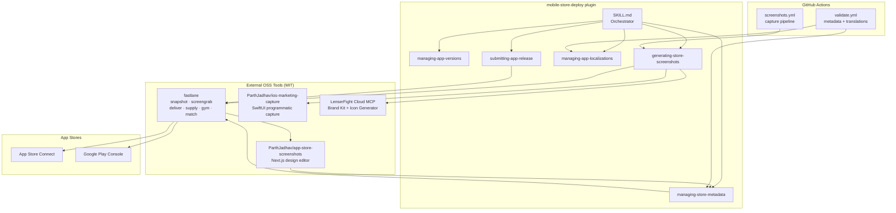
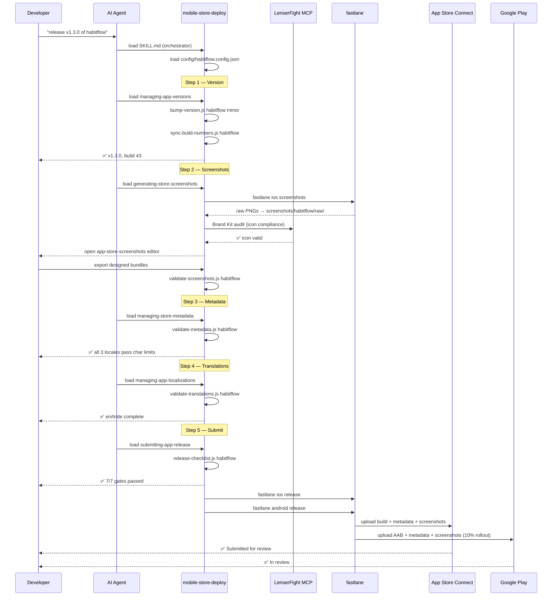
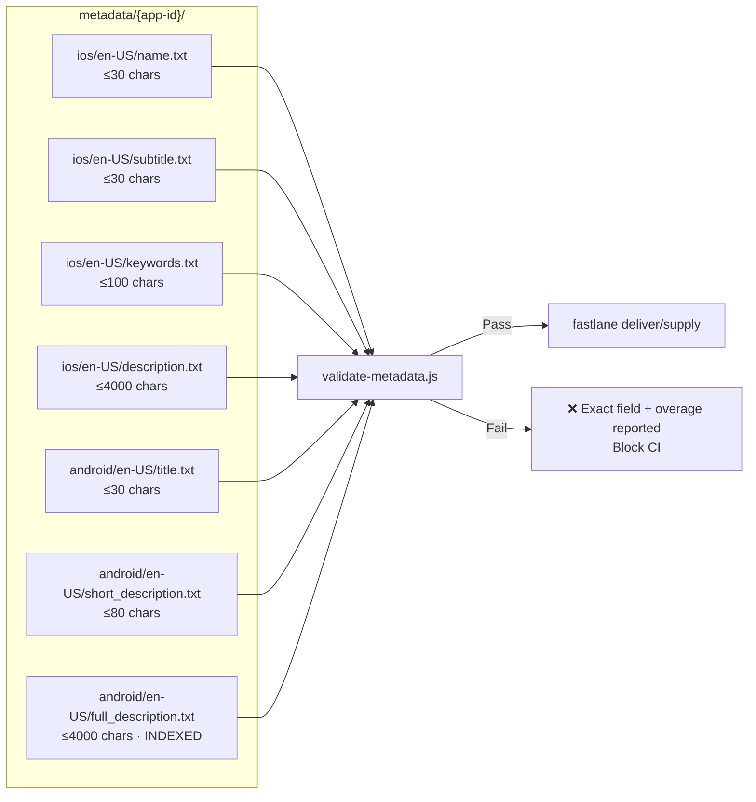

# Mobile Store Deploy — Plugin Planning Document

> Version 0.1 · June 2026 · MIT License

---

## 1. Problem Statement

| Pain Point | Root Cause |
|---|---|
| Managing version numbers across iOS + Android | No single source of truth — devs manually update Info.plist, build.gradle, app.json |
| Screenshot explosion (5 screens × 3 sizes × 2 platforms × 10 langs = **300 assets**) | No pipeline between simulator capture and store upload |
| Release notes per language per version | Text files scattered across projects, no validation |
| Internationalisation drift | i18n JSON files diverge from source locale, no CI gate |
| Store metadata character limits causing silent rejections | No pre-upload validator |

---

## 2. System Architecture



---

## 3. Data Flow — Full Release



---

## 4. Version Management Flow

```mermaid
flowchart LR
    A[versions/{app-id}/version.json<br/>Single Source of Truth] -->|bump-version.js| B[Updated semver<br/>+ build counter]
    B -->|sync-build-numbers.js| C1[app.json<br/>Expo target]
    B -->|sync-build-numbers.js| C2[ios/Info.plist<br/>Native iOS]
    B -->|sync-build-numbers.js| C3[android/build.gradle<br/>Native Android]
    B -->|validate-version.js| D{Valid?}
    D -->|Yes| E[git commit + tag<br/>v1.3.0+43]
    D -->|No — versionCode regressed| F[❌ Block commit]
```

---

## 5. Screenshot Pipeline Detail

```mermaid
flowchart TD
    A[config.json<br/>devices + locales] --> B

    subgraph Capture["Phase 1: Capture (fastlane)"]
        B[fastlane snapshot<br/>iOS simulators] --> D[raw PNGs per device/locale]
        C[fastlane screengrab<br/>Android emulators] --> D
    end

    subgraph Design["Phase 2: Design (OSS tools)"]
        D --> E{Choose tool}
        E -->|CLI / Claude Code agent| F[app-store-screenshots skill<br/>Next.js connected canvas editor]
        E -->|Web GUI| G[storeshots.org<br/>Nuxt 4 drag-drop editor]
        F & G --> H[Designed PNGs<br/>device frames + headlines + bg]
    end

    subgraph Validate["Phase 3: Validate"]
        H --> I[validate-screenshots.js<br/>check dimensions + count per locale]
        I -->|All pass| J[screenshots/{app-id}/designed/]
        I -->|Fail| K[❌ Missing sizes — report to dev]
    end

    subgraph Upload["Phase 4: Upload"]
        J --> L[fastlane deliver<br/>iOS upload]
        J --> M[fastlane supply<br/>Android upload]
    end
```

---

## 6. Metadata Validation Flow



---

## 7. i18n Flow

```mermaid
flowchart TD
    EN[locales/{app-id}/en.json<br/>Source of truth]
    EN --> TR[locales/{app-id}/tr.json]
    EN --> DE[locales/{app-id}/de.json]
    EN --> XX[locales/{app-id}/{locale}.json]

    TR & DE & XX --> V[validate-translations.js<br/>flattenKeys diff vs en.json]
    V -->|Missing keys| FIX[AI fills missing keys<br/>with context + glossary]
    FIX --> V
    V -->|All pass| CI[CI gate green]

    EN -->|extract-strings.js| STORE[store metadata strings<br/>managing-store-metadata skill]
```

---

## 8. AgentSkills.io Plugin Structure

Following the agentskills.io specification:

```
mobile-store-deploy/
├── SKILL.md                          ← Root orchestrator (progressive disclosure hub)
├── README.md
├── LICENSE                           ← MIT
├── PLAN.md                           ← This document
├── CHANGELOG.md
│
├── skills/                           ← Sub-skills (each is a standalone SKILL.md)
│   ├── managing-app-versions/
│   │   ├── SKILL.md
│   │   ├── scripts/
│   │   │   ├── bump-version.js
│   │   │   ├── sync-build-numbers.js
│   │   │   └── validate-version.js
│   │   └── references/
│   │       └── version-format.md
│   │
│   ├── generating-store-screenshots/
│   │   ├── SKILL.md
│   │   ├── scripts/
│   │   │   ├── validate-screenshots.js
│   │   │   └── audit-screenshots.js
│   │   ├── references/
│   │   │   ├── device-matrix.md       ← All required sizes, simulators
│   │   │   └── screenshot-specs.md    ← Export specs, pixel dimensions
│   │   └── assets/
│   │       └── device-frames/         ← PNG bezels for frameit
│   │
│   ├── managing-store-metadata/
│   │   ├── SKILL.md
│   │   ├── scripts/
│   │   │   ├── validate-metadata.js   ← Hard char limit enforcer
│   │   │   └── sync-to-store.sh
│   │   └── references/
│   │       ├── apple-limits.md        ← All Apple field limits + indexing
│   │       └── google-limits.md       ← All Google Play limits + indexing
│   │
│   ├── managing-app-localizations/
│   │   ├── SKILL.md
│   │   ├── scripts/
│   │   │   ├── extract-strings.js
│   │   │   └── validate-translations.js
│   │   └── references/
│   │       └── locale-codes.md        ← Platform locale code mapping table
│   │
│   └── submitting-app-release/
│       ├── SKILL.md
│       ├── scripts/
│       │   └── release-checklist.js   ← Pre-flight gate runner
│       └── references/
│           └── submission-checklist.md ← Fastfile template + env vars
│
├── metadata/                          ← App Store + Play Console copy
│   └── {app-id}/
│       ├── ios/
│       │   └── {locale}/
│       │       ├── name.txt           ← 30 chars
│       │       ├── subtitle.txt       ← 30 chars
│       │       ├── keywords.txt       ← 100 chars (comma,no,spaces)
│       │       ├── description.txt    ← 4000 chars (NOT indexed iOS)
│       │       ├── promotional.txt    ← 170 chars
│       │       └── release_notes.txt
│       └── android/
│           └── {locale}/
│               ├── title.txt          ← 30 chars
│               ├── short_description.txt ← 80 chars
│               ├── full_description.txt  ← 4000 chars (IS indexed)
│               └── release_notes.txt  ← 500 chars
│
├── screenshots/
│   └── {app-id}/
│       ├── raw/                       ← Simulator output (not committed)
│       │   └── {device}/{locale}/
│       └── designed/                  ← Design-layer output (committed)
│           ├── ios/{locale}/
│           └── android/{locale}/
│
├── versions/
│   └── {app-id}/
│       └── version.json               ← Single source of truth
│
├── locales/
│   └── {app-id}/
│       ├── en.json                    ← Source of truth
│       ├── tr.json
│       └── de.json
│
├── config/
│   ├── .template.config.json
│   └── {app-id}.config.json
│
├── fastlane/
│   ├── Fastfile                       ← See submission-checklist.md for template
│   ├── Appfile
│   ├── Snapfile
│   └── Screengrabfile
│
├── workflows/                         ← High-level workflow prompt files
│   ├── full-release.md
│   ├── screenshots-only.md
│   ├── metadata-update.md
│   └── add-locale.md
│
└── .github/
    └── workflows/
        ├── validate.yml               ← PR gate: metadata + translation checks
        └── screenshots.yml            ← Manual trigger: screenshot capture
```

---

## 9. Platform Limits Cheatsheet (hardcoded in validator)

### Apple App Store

| Field | Limit | Indexed? | Notes |
|---|---|---|---|
| App Name | **30** | ✅ | Strongest search signal |
| Subtitle | **30** | ✅ | Don't repeat Name words. Leave 1-2 char buffer |
| Keywords | **100** | ✅ | `comma,no,spaces` — don't repeat Name/Subtitle |
| Promotional Text | **170** | ❌ | Update without new version |
| Description | **4,000** | ❌ | Conversion copy only |
| What's New | **4,000** | ❌ | |
| IAP Name | **35** | ✅ | |
| IAP Description | **55** | ❌ | |
| In-App Event Title | **30** | ✅ | iOS 15+ |
| Screenshot captions | — | ✅ OCR | Since June 2025 — align with keywords |

### Google Play Store

| Field | Limit | Indexed? | Notes |
|---|---|---|---|
| Title | **30** | ✅ | Same limit as iOS |
| Short Description | **80** | ✅ | More than iOS subtitle |
| Full Description | **4,000** | ✅ | **Unlike iOS, this IS indexed** |
| What's New | **500** | ❌ | Much shorter than iOS |

---

## 10. Open Source Projects (MIT licensed)

| Project | Role in pipeline | License | Link |
|---|---|---|---|
| **fastlane** | Build, sign, screenshot capture, metadata upload, store submission | MIT | https://github.com/fastlane/fastlane |
| **ParthJadhav/app-store-screenshots** | Screenshot design layer — Next.js editor, AI copy, export | MIT | https://github.com/ParthJadhav/app-store-screenshots |
| **ParthJadhav/ios-marketing-capture** | iOS screenshot capture per locale (SwiftUI) | MIT | https://github.com/ParthJadhav/ios-marketing-capture |
| **eralpozcan/storeshots** | Alternative web-based screenshot editor | AGPL-3 | https://github.com/eralpozcan/storeshots |
| **i18next** | Runtime i18n for Expo/RN | MIT | https://github.com/i18next/i18next |
| **expo/eas-cli** | EAS Build and Submit CLI | MIT | https://github.com/expo/eas-cli |
| **hyochan/expo-iap** | In-app purchases for Expo (OpenIAP spec) | MIT | https://github.com/hyochan/expo-iap |
| **RevenueCat/react-native-purchases** | IAP wrapper with analytics | MIT | https://github.com/RevenueCat/react-native-purchases |
| **ever-co/ever-traduora** | Self-hosted TMS for translation workflow | GPL-3 | https://github.com/ever-co/ever-traduora |
| **i18next/i18next** | i18n framework for JS/RN/Expo | MIT | https://github.com/i18next/i18next |
| **agentskills/agentskills** | SKILL.md specification | Apache-2.0 | https://github.com/agentskills/agentskills |
| **LenserFight** | Brand kit, icon generation (Cloud MCP) | Open source | https://github.com/conectlens/lenserfight |

---

## 11. Workflow Prompt Files

### full-release.md
```
Perform a full release of {app-id} to both iOS App Store and Google Play.

Steps:
1. Bump version: [patch|minor|major] — current version is in versions/{app-id}/version.json
2. Validate and update all metadata in metadata/{app-id}/ for all locales
3. Generate or update store screenshots using the screenshot pipeline
4. Validate all i18n translation files under locales/{app-id}/
5. Run the pre-flight checklist: node skills/submitting-app-release/scripts/release-checklist.js {app-id}
6. If all gates pass, run fastlane submission for both platforms
7. Report the submitted version numbers and review status

Do not proceed past any failing gate without explicit user confirmation.
Character limit constraints are hard rules — never exceed them.
```

### screenshots-only.md
```
Generate updated store screenshots for {app-id}.

1. Load config/{app-id}.config.json to confirm devices and locales
2. Load skills/generating-store-screenshots/references/device-matrix.md for required sizes
3. Run fastlane snapshot (iOS) and/or screengrab (Android) to capture raw screenshots
4. Open the app-store-screenshots editor (npx skills add ParthJadhav/app-store-screenshots)
5. Import raw PNGs, design the marketing slides with device frames and headlines
6. Align screenshot headline text with keywords in metadata/{app-id}/ios/{locale}/keywords.txt
   (Apple OCR indexes caption text for search since June 2025)
7. Export designed bundles to screenshots/{app-id}/designed/
8. Run validate-screenshots.js to confirm all required sizes are present
```

### metadata-update.md
```
Update store metadata for {app-id}.

Context to gather first:
- Which locale(s) need updating?
- What changed? (description, keywords, release notes, promotional text)
- Is this for iOS, Android, or both?

Rules:
- Apple App Name: 30 chars max — do NOT exceed
- Apple Subtitle: 30 chars max — do NOT exceed (leave 1 char buffer)
- Apple Keywords: 100 chars, comma-separated, NO spaces after commas
- Apple Description: 4,000 chars max — NOT indexed for search on iOS
- Google Short Description: 80 chars max — IS indexed
- Google Full Description: 4,000 chars max — IS indexed (include keywords!)
- Google What's New: 500 chars max (NOT 4000 like iOS)

After any edit, run:
  node skills/managing-store-metadata/scripts/validate-metadata.js {app-id}

Fix all violations before uploading.
```

### add-locale.md
```
Add {locale} language support to {app-id}.

Steps:
1. Confirm locale codes across all platforms using:
   skills/managing-app-localizations/references/locale-codes.md
2. Copy locales/{app-id}/en.json → locales/{app-id}/{i18next-code}.json
3. Translate all keys (use AI with app context + glossary)
4. Validate: node scripts/validate-translations.js {app-id} {locale}
5. Create metadata folders:
   - metadata/{app-id}/ios/{ios-locale}/  (copy from en-US and translate)
   - metadata/{app-id}/android/{android-locale}/  (copy from en-US and translate)
6. Translate all metadata files, validate with validate-metadata.js
7. Add locale to config/{app-id}.config.json → locales[]
8. For RTL locales (ar, he, fa, ur): note that I18nManager.forceRTL(true) is required
9. Generate screenshots for the new locale (trigger screenshots-only workflow)
```

---

## 12. LenserFight Integration Notes

The **Brand Kit PDF and Store Icon Generator** lens (ID: `c0903096-4a2c-463f-b6c2-c26aa72c5e6d`)
automates:
- App icon generation at all required sizes from a 1024×1024 source
- Icon compliance check (no alpha channel for iOS, alpha OK for Android)
- Brand kit PDF export for team reference

**To integrate in this plugin:**
1. Store `lenserfight.brandKitLensId` in `config/{app-id}.config.json`
2. The `generating-store-screenshots` skill triggers this lens before screenshot design
3. Output icons land in `assets/{app-id}/icons/`
4. A custom screenshot workflow can be created in LenserFight pointing to the
   `app-store-screenshots` skill output directory

---

## 13. Implementation Kickoff Prompts

### Prompt A — Initialize a new app in the plugin
```
I want to add a new app to the mobile-store-deploy plugin.
App ID: {app-id}
Platforms: iOS and Android
Primary locale: en-US
Additional locales: tr-TR, de-DE

Please:
1. Create config/{app-id}.config.json from the template
2. Create the metadata folder structure for all three locales (iOS + Android)
3. Create the locales/{app-id}/en.json source file (ask me for the key list)
4. Create versions/{app-id}/version.json starting at 1.0.0 build 1
5. Show me the complete file tree for this app's entries
```

### Prompt B — First screenshot run
```
Generate the first set of store screenshots for {app-id}.

I have the app running on the iOS simulator. The scheme for UI Tests is "{app-id}UITests".
Locales: en-US and tr-TR
Devices: iPhone 16 Pro Max (required) and iPhone 11 Pro Max (recommended)

Use the ParthJadhav/app-store-screenshots skill to design the slides.
Style: clean minimal, warm neutrals, calm premium feel.
Number of slides: 5
Headline keywords to use (from keywords.txt): {paste keywords}

After design, validate dimensions and report what's ready for upload.
```

### Prompt C — Pre-release validation run
```
Run full pre-release validation for {app-id} version {semver}.

Check:
1. Version numbers in version.json, app.json, and native files are consistent
2. All metadata in metadata/{app-id}/ passes Apple and Google character limits
3. All i18n keys in locales/{app-id}/ are complete across all locales
4. Screenshots are present for all required device sizes
5. Run the release-checklist.js and report each gate result

Do not proceed to submission — only validate and report.
```

### Prompt D — Update keywords across all locales
```
Update the iOS keyword strategy for {app-id} across all locales.

Current keywords (en-US): {current}
New keyword research suggests: {new keywords}

Rules:
- Total budget: 100 characters per locale
- No spaces after commas
- Do not repeat words already in name.txt or subtitle.txt
- The description is NOT indexed on iOS — keywords must go in keywords.txt

For each locale (en-US, tr-TR, de-DE):
1. Read the current name.txt and subtitle.txt (words in these are auto-indexed)
2. Generate locale-appropriate keywords using the same semantic intent
3. Validate total character count
4. Write to metadata/{app-id}/ios/{locale}/keywords.txt
5. Run validate-metadata.js to confirm
```
